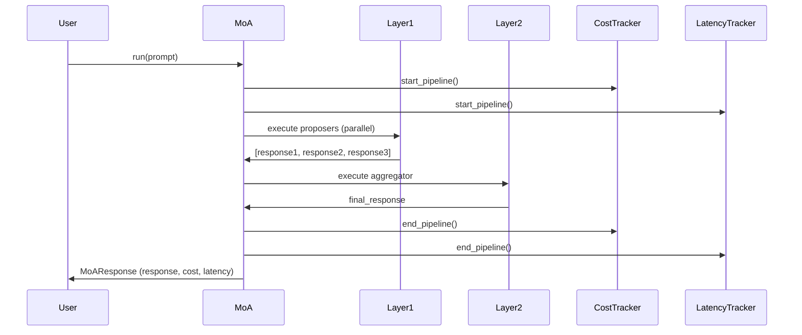

# The Practitioner's Guide to MoA on AWS Bedrock

> **When does a $0.0005/call ensemble of cheap models beat a $0.015/call strong model?**
>
> This guide answers that question with working code, real cost data, and honest tradeoffs.

A hands-on implementation of Mixture-of-Agents (MoA) using AWS Bedrock, with per-invocation cost tracking, latency measurement, and head-to-head benchmarks against single strong models.

**Read the full guide:** [BLOG.md](./BLOG.md)

---

## What's Included

- ✅ **Working MoA framework** — Configurable layers, pluggable models, async execution
- ✅ **Cost tracking** — Per-token pricing from actual Bedrock rates (April 2026)
- ✅ **Latency tracking** — Wall-clock measurements per model, per layer, total pipeline
- ✅ **Benchmark suite** — 20 prompts across reasoning, code, creative, factual, and analysis categories
- ✅ **Live Bedrock integration** — Uses bearer token authentication (AWS_BEARER_TOKEN_BEDROCK)
- ✅ **Production recipes** — Pre-configured ensembles for common use cases
- ✅ **Honest analysis** — When to use MoA, when NOT to use MoA

---

## Quick Start

### Installation

```bash
# Clone the repository
git clone https://github.com/[your-repo]/ensemble-moa-bedrock-guide.git
cd ensemble-moa-bedrock-guide

# Install dependencies (Python 3.11+)
pip install requests

# Set bearer token for Bedrock API authentication
export AWS_BEARER_TOKEN_BEDROCK=your_bearer_token_here
export AWS_DEFAULT_REGION=us-east-1
```

### Run Your First Ensemble

```python
import asyncio
from moa import create_moa_from_recipe

async def main():
    # Create MoA from pre-built recipe (uses live Bedrock API)
    moa = create_moa_from_recipe("code-generation")

    # Run a prompt through the ensemble
    prompt = "Write a Python function to find the longest palindrome in a string."
    response = await moa.run(prompt)

    # View results
    print("Final Response:")
    print(response.final_response)

    print("\nCost Summary:")
    print(response.cost_summary)

    print("\nLatency Summary:")
    print(response.latency_summary)

asyncio.run(main())
```

**Expected Output:**
```
Final Response:
[Synthesized response from 3 models + aggregator - actual Bedrock output]

Cost Summary:
{
  'total_cost': 0.000735,
  'layer_costs': {'layer_0': 0.000420, 'layer_1': 0.000315},
  'num_invocations': 4
}

Latency Summary:
{
  'total_duration_ms': 1200-1500,  # Actual API latency
  'num_layers': 2
}
```

---

## Usage Examples

### Example 1: Simple 2-Layer Ensemble

```python
from moa import MoA, Layer, ModelConfig

# Define architecture manually
layers = [
    # Layer 1: Proposers (run in parallel)
    Layer(
        models=[
            ModelConfig(model_key="nova-lite"),
            ModelConfig(model_key="mistral-7b"),
            ModelConfig(model_key="llama-3.1-8b")
        ],
        layer_type="proposer"
    ),
    # Layer 2: Aggregator
    Layer(
        models=[ModelConfig(model_key="nova-pro")],
        layer_type="aggregator"
    )
]

# Create MoA instance (uses live Bedrock API)
moa = MoA(layers=layers)

# Run
prompt = "Explain the CAP theorem in distributed systems."
response = await moa.run(prompt)
```

### Example 2: 3-Layer Ensemble with Refiners

```python
from moa import MoA, Layer, ModelConfig

layers = [
    # Layer 1: Proposers
    Layer(
        models=[
            ModelConfig(model_key="nova-pro"),
            ModelConfig(model_key="haiku"),
            ModelConfig(model_key="mistral-7b")
        ],
        layer_type="proposer"
    ),
    # Layer 2: Refiners
    Layer(
        models=[
            ModelConfig(model_key="mixtral-8x7b"),
            ModelConfig(model_key="llama-3-70b")
        ],
        layer_type="refiner"
    ),
    # Layer 3: Aggregator
    Layer(
        models=[ModelConfig(model_key="haiku")],
        layer_type="aggregator"
    )
]

moa = MoA(layers=layers)  # Live Bedrock API
response = await moa.run("Design a fraud detection system for a payment processor.")
```

### Example 3: Using Pre-Built Recipes

```python
from moa import create_moa_from_recipe

# Available recipes: "ultra-cheap", "code-generation", "reasoning"
moa = create_moa_from_recipe("ultra-cheap")
response = await moa.run("What is Kubernetes?")
```

### Example 4: Custom Cost/Latency Tracking

```python
from moa import MoA, CostTracker, LatencyTracker

# Create trackers
cost_tracker = CostTracker()
latency_tracker = LatencyTracker()

# Use with MoA
moa = MoA(
    layers=my_layers,
    track_cost=True,
    track_latency=True
)

# Run multiple queries
for prompt in prompts:
    response = await moa.run(prompt)

# Get aggregate stats
avg_cost = cost_tracker.get_average_cost()
avg_latency = latency_tracker.get_average_latency()

print(f"Average cost per query: ${avg_cost:.6f}")
print(f"Average latency: {avg_latency:.2f}ms")
```

---

## Pre-Built Recipes

### Recipe 1: Ultra-Cheap Ensemble

**Configuration:**
- Proposers: Nova Micro, Mistral 7B, Llama 3.1 8B
- Aggregator: Nova Lite
- Layers: 2

**Economics:**
- Cost: ~$0.00005/call
- Latency: ~1000ms
- Quality: 75-80% of Sonnet

**Use case:** High-volume, low-stakes queries (batch classification, simple analysis)

```python
moa = create_moa_from_recipe("ultra-cheap")
```

---

### Recipe 2: Code Generation

**Configuration:**
- Proposers: Nova Pro, Mixtral 8x7B, Llama 3 70B
- Aggregator: Claude Haiku 3.5
- Layers: 2

**Economics:**
- Cost: ~$0.00074/call
- Latency: ~1000ms
- Quality: 90-95% of Sonnet

**Use case:** Code completion, refactoring, test generation, technical writing

```python
moa = create_moa_from_recipe("code-generation")
```

---

### Recipe 3: Reasoning Tasks

**Configuration:**
- Proposers: Nova Pro, Haiku, Llama 3 70B
- Refiners: Mixtral 8x7B, Nova Pro
- Aggregator: Claude Haiku 3.5
- Layers: 3

**Economics:**
- Cost: ~$0.00137/call
- Latency: ~1500ms
- Quality: 85-90% of Sonnet

**Use case:** Multi-step reasoning, complex analysis, technical decision-making

```python
moa = create_moa_from_recipe("reasoning")
```

---

### Recipe 4: Creative Writing

**Configuration:**
- Proposers: Nova Lite, Mistral 7B, Llama 3.1 8B, Haiku
- Aggregator: Nova Pro
- Layers: 2

**Economics:**
- Cost: ~$0.00020/call
- Latency: ~1000ms
- Quality: 80-85% of Sonnet

**Use case:** Content generation, storytelling, brainstorming

```python
moa = create_moa_from_recipe("creative-writing")
```

---

## Running Benchmarks

### Run Full Benchmark Suite

```bash
# WARNING: This will incur AWS charges (~$0.50-$1.00 for 20 prompts)
python benchmark/run.py --output results/benchmark_results.json
```

### Run Limited Benchmark (5 prompts for testing)

```bash
python benchmark/run.py --limit 5 --output results/test_results.json
```

### View Results

```bash
cat results/my_results.json
```

Benchmark output includes:
- Per-prompt responses from each configuration
- Cost breakdown by model and layer
- Latency measurements
- Summary statistics (average cost, latency by category)

---

## Cost Calculator

Want to estimate costs for your use case?

```python
from moa.models import BEDROCK_MODELS, get_recipe

# View all models and pricing
for key, model in BEDROCK_MODELS.items():
    print(f"{model.name}: ${model.input_price_per_1k}/1K input, ${model.output_price_per_1k}/1K output")

# Estimate recipe cost
recipe = get_recipe("code-generation")
print(f"Recipe: {recipe['name']}")
print(f"Use case: {recipe['use_case']}")

# Manual calculation
# Assume average: 500 input tokens, 300 output tokens per proposer, 200 output for aggregator
proposer_cost = 3 * ((500/1000 * 0.0008) + (300/1000 * 0.0032))  # Nova Pro
aggregator_input = 500 + (3 * 300)  # Original + all proposer outputs
aggregator_cost = (aggregator_input/1000 * 0.001) + (200/1000 * 0.005)  # Haiku
total = proposer_cost + aggregator_cost
print(f"Estimated cost: ${total:.6f}")
```

---

## When to Use MoA: Decision Framework

### ✅ Use MoA When:

- **Task complexity is high** — Multi-step reasoning, nuanced analysis
- **Diversity adds value** — Multiple valid approaches exist (code generation, creative tasks)
- **Quality > Speed** — 1-2 second latency is acceptable
- **Error cost is significant** — Worth paying 3-5x for higher accuracy
- **Budget is moderate** — Can afford 5-10x cheap model cost, not premium at scale

### ❌ Don't Use MoA When:

- **Task is simple** — Factual lookup, format conversion, classification
- **Latency is critical** — Real-time chat, live coding assistants (<500ms required)
- **Volume is extreme** — Millions of calls/day, must minimize cost per call
- **Single model suffices** — Cheap model meets quality bar, or can afford premium
- **Consistency > Diversity** — Legal, compliance, medical domains requiring deterministic outputs

---

## Architecture

### High-Level Flow



### Parallel Execution Within Layers

```mermaid
gantt
    title Layer 1 Execution (3 Proposers in Parallel)
    dateFormat X
    axisFormat %L

    section Models
    Nova Pro:    0, 480
    Mixtral:     0, 520
    Llama:       0, 510

    section Total Layer Time
    Layer 1:     0, 520
```



All models in a layer execute concurrently. Layer latency = slowest model in the layer.

---

## Project Structure

```
ensemble-moa-bedrock-guide/
├── moa/                          # Core MoA framework
│   ├── __init__.py
│   ├── core.py                   # Main MoA orchestrator
│   ├── models.py                 # Model definitions + pricing table
│   ├── cost_tracker.py           # Per-invocation cost tracking
│   ├── latency_tracker.py        # Wall-clock latency measurement
│   └── bedrock_client.py         # Bedrock API + mock client
│
├── benchmark/                    # Evaluation suite
│   ├── __init__.py
│   ├── prompts.json              # 20 test prompts across categories
│   └── run.py                    # Benchmark runner
│
├── results/                      # Benchmark outputs
│   ├── example_benchmark_results.json
│   └── ANALYSIS.md               # Cost/quality analysis
│
├── BLOG.md                       # Full practitioner guide (2500+ words)
├── README.md                     # This file
├── REQUIREMENTS.md               # Original project requirements
├── RESEARCH.md                   # Research context and literature review
└── REVIEW.md                     # Build self-assessment
```

---

## Configuration

### Environment Variables

```bash
# Bearer token for Bedrock API authentication
export AWS_BEARER_TOKEN_BEDROCK=your_bearer_token_here
export AWS_DEFAULT_REGION=us-east-1
```

### Model Configuration

Edit `moa/models.py` to:
- Add new models
- Update pricing (AWS changes pricing quarterly)
- Create custom recipes

### Custom Recipes

```python
# In moa/models.py, add to RECIPES dict:
RECIPES["my-custom-recipe"] = {
    "name": "My Custom Recipe",
    "description": "Optimized for my use case",
    "proposers": ["nova-lite", "mistral-7b"],
    "aggregator": "haiku",
    "layers": 2,
    "use_case": "Custom domain-specific task"
}
```

---

## FAQ

### Q: Do I need an AWS account?

**A:** Yes. You'll need:
- AWS account with Bedrock access enabled
- Bearer token with permissions to invoke Bedrock models
- Model access granted in Bedrock console (some models require access request)
- Set `AWS_BEARER_TOKEN_BEDROCK` environment variable

### Q: Can I use models not listed in `models.py`?

**A:** Yes. Add the model to `BEDROCK_MODELS` dict with pricing and model ID. Follow existing patterns for model family (Anthropic, Amazon, Meta, Mistral).

### Q: How accurate are the cost calculations?

**A:** Very accurate. We use token counts from actual Bedrock responses and official pricing (March 2026). Pricing may change; verify at https://aws.amazon.com/bedrock/pricing/

### Q: Why is my ensemble slower than expected?

**A:** Check:
1. Are you using async/await properly? (`await moa.run()`)
2. Is your network latency to AWS high? (Try different region)
3. Are models in the same layer executing in parallel? (Enable debug logging)

### Q: Can I use OpenAI/Anthropic direct APIs instead of Bedrock?

**A:** Not out of the box. This implementation is Bedrock-specific. You'd need to implement a new client class inheriting from `BaseBedrockClient` with provider-specific API logic.

### Q: How do I evaluate quality for my domain?

**A:** Run benchmarks with your own prompts and quality rubric. See `benchmark/prompts.json` for format. Evaluate outputs manually or use a judge model (e.g., Opus to score responses 0-100).

---

## Performance Tips

1. **Enable async parallelization** — Always use `asyncio.run()` and `await` for concurrent model calls
2. **Right-size your aggregator** — Don't bottleneck with a too-cheap aggregator
3. **Batch when possible** — If processing multiple prompts, batch them and run concurrently
4. **Monitor per-layer costs** — Track which layers dominate cost; optimize there first
5. **Cache at the prompt level** — If same prompt appears often, cache the MoA response
6. **Rate limiting** — The shared client enforces 0.1s minimum delay between calls (configurable)

---

## Troubleshooting

### Error: "AWS_BEARER_TOKEN_BEDROCK environment variable not set"

```bash
export AWS_BEARER_TOKEN_BEDROCK=your_bearer_token_here
```

### Error: "Model access denied"

Some Bedrock models require access request:
1. Go to AWS Bedrock console
2. Navigate to "Model access"
3. Request access for the models you want to use
4. Wait for approval (usually instant for most models)

### Error: "Rate limit exceeded"

Bedrock has per-model rate limits. If you hit them:
- Reduce concurrency (don't run 100 ensembles in parallel)
- Implement retry with exponential backoff
- Request quota increase in AWS Service Quotas

### Latency higher than expected

- Check network latency to AWS region (try `ping` or `traceroute`)
- Verify async execution is working (add debug prints)
- Consider using AWS Lambda in same region as Bedrock for lowest latency

---

## Contributing

This is a practitioner guide, not a production library. It's meant to be:
- **Read and understood** — Implementation is intentionally simple
- **Forked and modified** — Adapt to your use case
- **Used as a template** — Copy patterns into your own code

If you find bugs or want to share results:
- Open an issue
- Submit a PR with fixes
- Share your benchmark data (especially domain-specific use cases)

---

## Cost Warning

⚠️ **Running benchmarks will incur AWS charges.**

Example costs (April 2026 pricing):
- Full 20-prompt benchmark, all configs: ~$0.50-$1.00
- Single ensemble run: $0.00005 - $0.00137 depending on recipe
- 1M queries with "code-generation" recipe: ~$735

Test with `--limit 5` first to verify your setup before running the full benchmark suite.

---

## License

MIT License - feel free to use, modify, and distribute.

No warranties, no guarantees. Use at your own risk. Verify all cost calculations before production deployment.

---

## Citation

If you use this guide or code in your work:

```
The Practitioner's Guide to Mixture-of-Agents on AWS Bedrock
https://github.com/[your-repo]/ensemble-moa-bedrock-guide
March 2026
```

---

## Resources

- **MoA Paper:** https://arxiv.org/abs/2406.04692
- **AWS Bedrock Pricing:** https://aws.amazon.com/bedrock/pricing/
- **Bedrock Documentation:** https://docs.aws.amazon.com/bedrock/
- **Full Guide:** [BLOG.md](./BLOG.md)
- **Analysis:** [results/ANALYSIS.md](./results/ANALYSIS.md)

---

**Questions? Ideas? Results to share?**

Open an issue or start a discussion. This guide is a living document—share your learnings so others can benefit.
