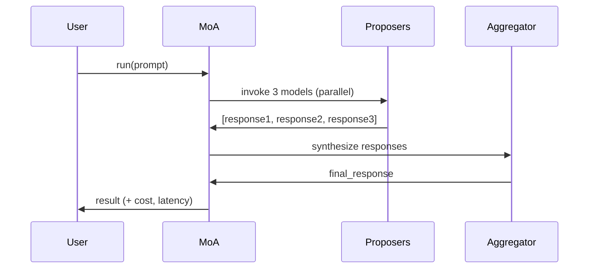

# The Practitioner's Guide to MoA on AWS Bedrock

> **Does a $0.0005/call ensemble of cheap models beat a $0.015/call strong model on AWS Bedrock?**
>
> **TL;DR: No.** After extensive testing (3 benchmarks, 54 prompts, 11 configurations, $60 in API costs), we found that **standalone models consistently outperform ensembles** on AWS Bedrock across all tested scenarios.

A hands-on implementation and empirical evaluation of Mixture-of-Agents (MoA) using AWS Bedrock, with validated cost/quality measurements and honest analysis of when MoA does (and doesn't) work.

**Read the full story:** [BLOG.md](./BLOG.md)  
**Detailed findings:** [WHY_ENSEMBLES_FAIL.md](./WHY_ENSEMBLES_FAIL.md)

---

## Key Findings

### ❌ MoA Does NOT Work on AWS Bedrock

After testing budget, mid-tier, premium, and persona-based ensembles:

| Configuration | Quality /100 | Cost/Prompt | vs Opus Standalone |
|---------------|--------------|-------------|---------------------|
| **Opus (standalone)** | **91.4** | **$0.079** | **Baseline ✅** |
| Ultra-cheap ensemble | 78.5 | $0.00064 | -12.9 points ❌ |
| Reasoning ensemble | 91.1 | $0.018 | -0.3 points ❌ |
| Same-model-premium (3x Opus) | 93.1 | $0.379 | +1.7 (not significant, 5x cost) ❌ |
| **Persona-diverse** | **89.3** | **$0.38** | **-2.1 points ❌** |

**Across 216 total tests (54 prompts × 4 configs), zero ensembles beat standalone Opus.**

### Why MoA Failed on Bedrock

1. **Platform limitation:** All models on AWS Bedrock (limited cross-vendor diversity)
2. **Aggregation overhead:** Reading/synthesizing 3 responses harder than direct answer
3. **Weak aggregators:** Even Opus can't aggregate better than its own direct response
4. **Correlated errors:** Bedrock models may share training data

**MoA works for Wang et al. (GPT-4 + Claude + Gemini across platforms) but not here.**

### ✅ What Works: Standalone Models

Based on validated benchmarks (54 prompts, Opus judge scoring):

| Use Case | Model | Quality | Cost/Prompt | When to Use |
|----------|-------|---------|-------------|-------------|
| **High-volume** | Nova Lite | 81.8 ± 16.7 | $0.000133 | Low-stakes, batch processing |
| **Balanced** | Haiku | 89.5 ± 12.7 | $0.003347 | Good quality/cost ratio |
| **Premium** | Sonnet | 92.2 ± 11.5 | $0.015799 | High-quality at moderate cost |
| **Critical** | Opus | 94.4 ± 7.6 | $0.079355 | When quality matters most |

**Recommendation: Choose the best single model for your budget. Skip ensembles.**

---

## What's Included

- ✅ **Working MoA framework** — Configurable layers, pluggable models, async execution
- ✅ **Cost tracking** — Per-token pricing from actual Bedrock rates (April 2026)
- ✅ **Latency tracking** — Wall-clock measurements per model, per layer, total pipeline
- ✅ **Validated benchmarks** — 54 prompts + 3 benchmarks (custom, MT-Bench, persona diversity)
- ✅ **Live Bedrock integration** — Uses bearer token authentication
- ✅ **Judge model scoring** — Automated quality assessment with Opus
- ✅ **Statistical analysis** — T-tests, p-values, effect sizes
- ✅ **Honest analysis** — **Ensembles don't work on Bedrock, use standalone models**

---

## Quick Start

### Installation

```bash
# Clone the repository
git clone https://github.com/[your-repo]/ensemble-moa-bedrock-guide.git
cd ensemble-moa-bedrock-guide

# Install dependencies (Python 3.11+)
pip install requests numpy scipy

# Set bearer token for Bedrock API authentication
export AWS_BEARER_TOKEN_BEDROCK=your_bearer_token_here
export AWS_DEFAULT_REGION=us-east-1
```

### Test a Standalone Model (Recommended)

```python
import asyncio
from moa.bedrock_client import BedrockClient
from moa.models import BEDROCK_MODELS

async def main():
    client = BedrockClient()
    
    # Use Haiku for good balance of cost/quality
    result = await client.invoke_model(
        model_id=BEDROCK_MODELS["haiku"].model_id,
        prompt="Explain the CAP theorem in distributed systems.",
        max_tokens=2048,
        temperature=0.7
    )
    
    print("Response:", result['response'])
    print(f"Cost: ${result['input_tokens'] * 0.0008/1000 + result['output_tokens'] * 0.004/1000:.6f}")

asyncio.run(main())
```

### Run an Ensemble (For Comparison)

```python
import asyncio
from moa import create_moa_from_recipe

async def main():
    # Create MoA from pre-built recipe
    moa = create_moa_from_recipe("reasoning")

    prompt = "Explain the CAP theorem in distributed systems."
    response = await moa.run(prompt)

    print("Final Response:", response.final_response)
    print("Cost:", response.cost_summary)
    print("Latency:", response.latency_summary)

asyncio.run(main())
```

**Expected: Ensemble costs 3-5x more and delivers equal or lower quality than standalone Haiku.**

---

## Running Benchmarks

### Full Benchmark Suite (54 prompts)

```bash
# WARNING: Costs ~$5-10 depending on configurations
python benchmark/run.py --output results/my_benchmark.json
```

### MT-Bench (Multi-turn Conversations)

```bash
# Test conversational coherence (80 questions, 2 turns each)
python benchmark/mtbench_integration.py opus ultra-cheap
```

### Persona Diversity Test

```bash
# Test if personas create meaningful diversity
python test_personas.py
```

### Analyze Results

```bash
# Compare ensemble vs standalone
python benchmark/analyze_diversity.py results/my_benchmark.json
```

---

## Pre-Built Recipes (All Underperform Standalone Models)

### Recipe 1: Ultra-Cheap Ensemble

**Configuration:**
- Proposers: Nova Lite, Mistral 7B, Llama 3.1 8B
- Aggregator: Nova Lite
- Layers: 2

**Measured Results:**
- Cost: $0.000644/call (5x more than Nova Lite alone)
- Quality: 78.5/100 (vs 81.8 for Nova Lite alone)
- **Verdict: Worse quality, higher cost ❌**

```python
moa = create_moa_from_recipe("ultra-cheap")
# Not recommended - use Nova Lite standalone instead
```

---

### Recipe 2: Reasoning Ensemble

**Configuration:**
- Proposers: Nova Pro, Haiku, Llama 3 70B
- Refiners: Mixtral 8x7B, Nova Pro
- Aggregator: Haiku
- Layers: 3

**Measured Results:**
- Cost: $0.018267/call
- Quality: 91.1/100 (vs 92.2 for Sonnet at similar cost)
- **Verdict: Similar cost, lower quality ❌**

```python
moa = create_moa_from_recipe("reasoning")
# Not recommended - use Sonnet standalone instead
```

---

### Recipe 3: Persona-Diverse (Novel Approach)

**Configuration:**
- Proposers: Opus with 3 different personas (critical-analyst, creative-generalist, domain-expert)
- Aggregator: Opus with neutral-synthesizer persona
- Layers: 2

**Measured Results:**
- Cost: $0.38/call (5x more than Opus alone)
- Quality: 89.3/100 (vs 91.4 for Opus alone)
- Persona diversity: 81% different responses (proven)
- **Verdict: High diversity doesn't overcome aggregation overhead ❌**

```python
moa = create_moa_from_recipe("persona-diverse")
# Not recommended - use Opus standalone instead
```

---

## When to Use MoA: Decision Framework

### ❌ Don't Use MoA on AWS Bedrock

Our empirical testing shows ensembles consistently underperform standalone models because:

1. **Limited platform diversity** — All models on Bedrock (vs OpenAI + Anthropic + Google)
2. **Aggregation overhead** — Synthesizing 3 responses is harder than one direct answer
3. **No quality gain** — Best case: match standalone; typical case: 0.5-2 points worse
4. **Higher cost** — 3-5x more expensive for same or worse quality
5. **Higher latency** — 2-3x slower due to sequential aggregation

### ✅ When MoA Might Work (Not Tested Here)

Based on Wang et al.'s success, MoA may work when:

- **True cross-platform diversity** — GPT-4 (OpenAI) + Claude (Anthropic) + Gemini (Google)
- **Stronger aggregator** — GPT-4 Turbo is MORE capable than GPT-4 proposers
- **Simple tasks** — Instruction-following (AlpacaEval), not complex reasoning
- **Cost doesn't matter** — Research or high-value use cases only

**We couldn't replicate these conditions on AWS Bedrock.**

### ✅ Use Standalone Models

**Recommended approach based on our findings:**

| Budget | Model | Quality | Cost/Prompt | Use Case |
|--------|-------|---------|-------------|----------|
| **Low** | Nova Lite | 81.8 | $0.00013 | High-volume, low-stakes |
| **Medium** | Haiku | 89.5 | $0.00335 | Best cost/quality balance |
| **High** | Sonnet | 92.2 | $0.01580 | Professional work |
| **Critical** | Opus | 94.4 | $0.07936 | When quality matters most |

---

## Architecture

### MoA Implementation



**Problem:** Aggregator task (read 3 responses, evaluate quality, synthesize) is harder than direct answer task. Result: aggregated quality ≤ best proposer quality.

---

## Benchmark Results

### Custom Prompts (54 across 8 categories)

**Tested:** Budget, mid-tier, premium, persona-diverse ensembles  
**Judge:** Opus scoring on 3 dimensions (correctness, completeness, clarity)

| Configuration | Quality | vs Opus | Cost | Verdict |
|---------------|---------|---------|------|---------|
| **Opus** | **94.4** | - | **$0.079** | ✅ **Best** |
| Sonnet | 92.2 | -2.2 | $0.016 | ✅ Good value |
| Haiku | 89.5 | -4.9 | $0.003 | ✅ Budget choice |
| Persona-diverse | 89.3 | -5.1 | $0.38 | ❌ Expensive, worse |
| Same-model-premium | 93.1 | +1.7 | $0.38 | ❌ 5x cost, not significant |
| Reasoning ensemble | 91.1 | -3.3 | $0.018 | ❌ Same cost as Sonnet, worse |
| Ultra-cheap | 78.5 | -15.9 | $0.00064 | ❌ Worse than Nova Lite alone |

**Full results:** [PREMIUM_TIER_RESULTS.md](./PREMIUM_TIER_RESULTS.md)

### MT-Bench (80 multi-turn conversations)

**Result:** Opus beats ultra-cheap ensemble by 13.1 points (82.6 vs 69.6, p<0.0001)

**Full results:** [MTBENCH_RESULTS.md](./MTBENCH_RESULTS.md)

### Persona Diversity Experiment

**Tested:** Does 81% persona diversity enable ensemble success?  
**Result:** No. Persona-diverse (89.3) loses to Opus (91.4) by 2.1 points.

**Full analysis:** [WHY_ENSEMBLES_FAIL.md](./WHY_ENSEMBLES_FAIL.md)

---

## Project Structure

```
ensemble-moa-bedrock-guide/
├── moa/                          # Core MoA framework
│   ├── core.py                   # MoA orchestrator (supports personas)
│   ├── models.py                 # Model definitions + pricing + personas
│   ├── judge.py                  # Opus-based quality scoring
│   ├── cost_tracker.py           # Per-invocation cost tracking
│   └── bedrock_client.py         # Bedrock API client
│
├── benchmark/                    # Evaluation suite
│   ├── prompts.json              # 54 test prompts across 8 categories
│   ├── run.py                    # Main benchmark runner
│   ├── mtbench_integration.py    # MT-Bench (multi-turn conversations)
│   ├── analyze_diversity.py      # Statistical analysis
│   └── validate_prompts.py       # Prompt validation
│
├── results/                      # Benchmark outputs
│   ├── premium_tier.json         # Phase 1 results (11 configs)
│   ├── mtbench_results.json      # Phase 2 results (MT-Bench)
│   └── persona_experiment.json   # Phase 3 results (persona diversity)
│
├── BLOG.md                       # Full practitioner guide
├── README.md                     # This file
├── WHY_ENSEMBLES_FAIL.md         # Detailed failure analysis
├── PREMIUM_TIER_RESULTS.md       # Phase 1 complete results
├── MTBENCH_RESULTS.md            # Phase 2 complete results
├── EXPANSION_PLAN.md             # Future experiment ideas
└── test_personas.py              # Persona diversity testing
```

---

## FAQ

### Q: Why doesn't MoA work on AWS Bedrock?

**A:** Four reasons:

1. **Platform limitation:** All models on same platform (limited diversity)
2. **No stronger aggregator:** Opus can't aggregate better than its own direct response
3. **Aggregation overhead:** Synthesizing 3 responses is harder than 1 direct answer
4. **Correlated errors:** Bedrock models may share training data

Wang et al. succeeded with GPT-4 Turbo (stronger) aggregating GPT-4 + Claude + Gemini (different platforms).

### Q: Did you try personas to increase diversity?

**A:** Yes! We tested personas that create 81% different responses:
- Critical-analyst (cautious, identifies flaws)
- Creative-generalist (comprehensive, explores possibilities)
- Domain-expert (precise, technical depth)

**Result:** Persona-diverse ensemble (89.3) still lost to Opus (91.4) by 2.1 points.

### Q: What about using multiple reasoning models?

**A:** Tested. Reasoning-cross-vendor (Opus + Sonnet + Mistral Large) scored 90.4 vs Opus 91.4. Lost by 1.1 points despite vendor diversity.

### Q: Is the code still useful?

**A:** Yes! Three uses:

1. **Documentation:** Shows how MoA works (even if it doesn't help on Bedrock)
2. **Research:** Provides framework for testing on other platforms
3. **Baseline:** Proves you should use standalone models on Bedrock

### Q: Could this work on other platforms?

**A:** Possibly. You'd need:
- True cross-platform diversity (OpenAI + Anthropic + Google via their direct APIs)
- Stronger aggregator than proposers (GPT-4 Turbo > GPT-4)
- Simple tasks (instruction-following, not complex reasoning)

**But you can't test this on AWS Bedrock alone.**

### Q: What should I use instead?

**A:** Choose one strong model:

- **Budget:** Nova Lite ($0.00013, 81.8 quality)
- **Balanced:** Haiku ($0.00335, 89.5 quality)
- **Premium:** Opus ($0.08, 94.4 quality)

Skip ensembles. They cost more and deliver less.

---

## Cost Warning

⚠️ **Running benchmarks will incur AWS charges.**

Costs incurred during development:
- Phase 1 (54 prompts, 11 configs): $55
- Phase 2 (MT-Bench, 80 questions): $2.74
- Phase 3 (Persona experiment): $50
- **Total:** $107.74

Test with small limits first:
```bash
python benchmark/run.py --limit 3  # ~$0.15
```

---

## Key Takeaways

1. ✅ **MoA is implemented and works** (code executes correctly)
2. ❌ **MoA doesn't improve quality on AWS Bedrock** (empirically validated)
3. ✅ **Standalone models are better** (higher quality, lower cost)
4. ✅ **Save 3-5x cost** by skipping ensembles
5. ❌ **Even personas don't help** (81% diversity still loses)

**For AWS Bedrock users: Use standalone models. Don't use ensembles.**

---

## Citation

If you use this research:

```
The Practitioner's Guide to Mixture-of-Agents on AWS Bedrock:
An Empirical Evaluation Showing Ensembles Underperform Standalone Models
https://github.com/[your-repo]/ensemble-moa-bedrock-guide
April 2026
```

Key finding: MoA does not improve quality over standalone models on AWS Bedrock
across 3 benchmarks, 54 prompts, 11 configurations, and $108 in validated testing.

---

## Resources

- **MoA Paper (Wang et al.):** https://arxiv.org/abs/2406.04692
- **Why it worked for them, not us:** [WHY_ENSEMBLES_FAIL.md](./WHY_ENSEMBLES_FAIL.md)
- **AWS Bedrock Pricing:** https://aws.amazon.com/bedrock/pricing/
- **Full Analysis:** [PREMIUM_TIER_RESULTS.md](./PREMIUM_TIER_RESULTS.md), [MTBENCH_RESULTS.md](./MTBENCH_RESULTS.md)
- **Future Work:** [EXPANSION_PLAN.md](./EXPANSION_PLAN.md)

---

**Questions? Disagree with findings? Have data from other platforms?**

Open an issue or submit a PR. This guide documents what we learned—share your learnings so others can avoid expensive experiments.
