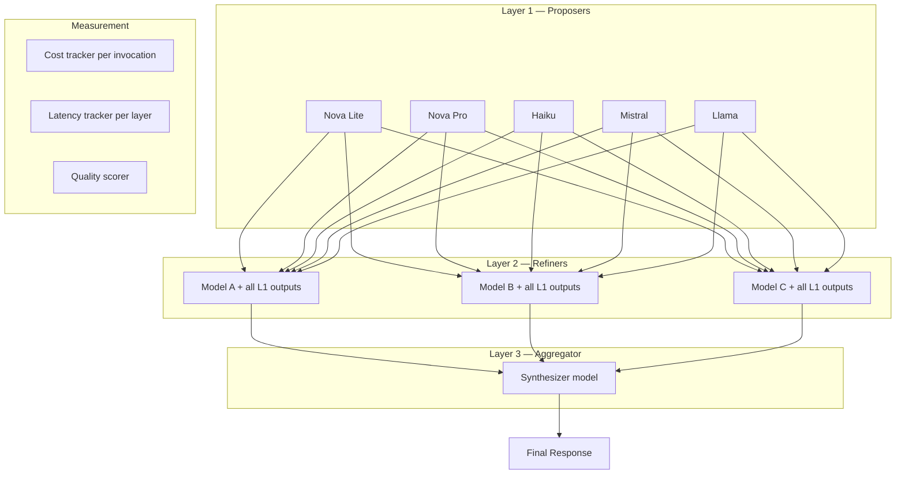

# Requirements: "The Practitioner's Guide to MoA on Bedrock"

_protoGen project — LLM Ensemble Methods (2 of 3)_

## What We're Building

A hands-on implementation guide for Mixture-of-Agents on AWS Bedrock using smaller/cheaper models (Nova Lite, Nova Pro, Haiku, Mistral, Llama). The guide includes working code, architecture diagrams, real per-invocation cost data, latency measurements at each ensemble layer, and head-to-head benchmarks of cheap-model ensembles vs single strong models (Sonnet, Opus). The deliverable is a practitioner-first guide that answers: when does a $0.001/call ensemble of 3 cheap models beat a single $0.015/call strong model, and what's the actual cost curve?

## Why (Blog Angle)

Every MoA paper shows accuracy gains and hand-waves cost. The economics angle is the gap nobody has filled. Practitioners making deployment decisions need concrete numbers: per-invocation costs across the Bedrock model roster, latency at each MoA layer, and the actual ROI crossover point. This is the guide that answers "should I actually do this?" with data instead of theory. CC's AWS/Bedrock expertise makes this credible in a way academic papers can't be.

## Architecture



**Components:**
1. **MoA framework** — Configurable layers, pluggable models, Bedrock API integration. Support 2-3 layer architectures.
2. **Cost tracker** — Captures input/output token counts and calculates actual cost per invocation using current Bedrock pricing
3. **Latency tracker** — Wall-clock time per model call, per layer, total pipeline
4. **Benchmark suite** — Standard eval prompts (reasoning, code, writing, analysis) run through: (a) each cheap model solo, (b) ensemble of cheap models, (c) single strong model (Sonnet/Opus)
5. **Results dashboard** — Cost vs quality scatter plots, latency breakdown, ROI curve

## Scope

**In:**
- Working Python implementation of MoA on Bedrock (boto3/bedrock-runtime)
- 5+ cheap models as ensemble members (Nova Lite, Nova Pro, Haiku, Mistral 7B/Mixtral, Llama 3)
- 2 strong models as baselines (Sonnet, Opus)
- Real cost data from Bedrock pricing (per-token, per-invocation)
- Latency measurements (parallel vs sequential layer execution)
- Eval suite: 15-20 prompts across categories (reasoning, code, creative, factual)
- Quality comparison methodology (judge model + manual spot-check)
- Architecture diagrams (Mermaid)
- BLOG.md output (Medium-ready, practitioner tone)

**Out:**
- Reasoning/thinking models (that's Project 1)
- Production-grade framework (this is a guide, not a library)
- Fine-tuning
- Non-Bedrock providers
- Formal benchmarking against published datasets (keep it practical)

## Acceptance Criteria

```gherkin
Given the MoA framework is implemented
When configured with N cheap models across L layers
Then it produces a synthesized response using the MoA architecture via Bedrock API

Given a prompt is processed through the MoA pipeline
When cost tracking is active
Then per-model token counts, per-invocation costs, and total pipeline cost are logged

Given the benchmark suite runs against cheap-model ensemble AND single strong model
When results are compared
Then a cost-vs-quality matrix shows the crossover point where ensemble ROI turns positive/negative

Given all benchmarks are complete
Then a BLOG.md is produced with: working code snippets, architecture diagrams, cost tables, latency charts, and clear practitioner guidance on when to use MoA vs single strong model

Given the guide includes cost data
Then all costs reference current Bedrock pricing with dates, and include a note about checking for pricing changes
```

## Key Decisions (from research)

1. **Model selection for the ensemble should be diverse.** Different model families (Nova, Anthropic, Meta, Mistral) to minimize correlated errors — this is the whole theoretical basis for why ensembles work. Same-family models may fail the same way.
2. **Parallel execution is critical for latency.** MoA layers should fire all models concurrently. Sequential execution makes latency unacceptable. Use asyncio/threading for Bedrock calls.
3. **The aggregator model choice matters.** If the aggregator needs to be Sonnet to produce good synthesis, that undermines the "cheap ensemble" value prop. Test with a cheap aggregator too.
4. **Surface the "when NOT to ensemble" answer.** If Sonnet alone beats the ensemble on 80% of prompts at lower latency, say so clearly. Honest results > advocacy.
5. **Cost calculation must include the aggregator.** Don't just count the proposer layer — the full pipeline cost including synthesis is what practitioners pay.
6. **Include a "recipes" section.** E.g., "For code generation: Nova Pro + Mistral + Llama, 2 layers, Haiku aggregator = $X per call, Y% quality of Sonnet."

## Resources

- MoA paper: arxiv.org/abs/2406.04692
- LLM-Blender: arxiv.org/abs/2306.02561
- Efficient Dynamic Ensembling (IJCAI 2025) — dynamic model selection to reduce cost
- Bedrock pricing page: aws.amazon.com/bedrock/pricing/
- Full research context: ~/.openclaw/workspace-techwriter/research/llm-ensemble-methods-context.md
