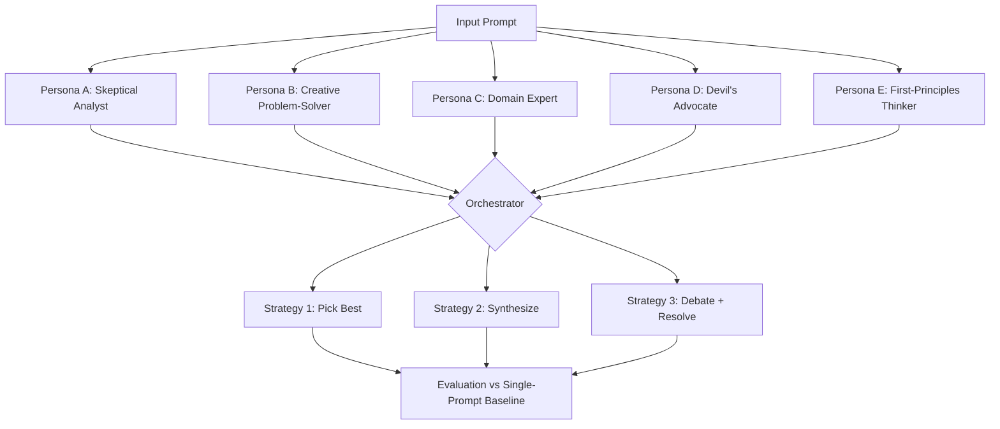

# Requirements: "Same Model, Different Minds"

_protoGen project — LLM Ensemble Methods (3 of 3)_

## What We're Building

An experiment and blog post exploring persona-based ensembling: the same LLM with different system prompts/personas answers a question, then a central orchestrator synthesizes the final output. This is the CABAL multi-agent pattern generalized into an ensemble technique. We build the system, test it across prompt categories, and write about what actually happens — does persona diversity create real answer diversity, or just cosmetic variation? Does the orchestrator pick-the-best or synthesize-something-better? When does this beat a single carefully-prompted call?

## Why (Blog Angle)

This is the least explored angle in LLM ensemble literature. Research focuses on ensembling different models; nobody has systematically studied same-model persona diversity as an ensemble strategy. CC is literally living this architecture with CABAL (same base model, specialized personas, orchestrated output). The blog connects multi-agent system design to ensemble theory in a way that hasn't been written up. It's original, it's practical, and it has a built-in case study.

## Architecture



**Components:**
1. **Persona library** — 5-7 distinct personas with carefully designed system prompts that should produce genuinely different analytical lenses (not just different "tones")
2. **Parallel runner** — Sends same prompt to same model with each persona via Bedrock API
3. **Orchestrator** — Three synthesis strategies:
   - **Pick-best:** Judge selects the strongest individual response
   - **Synthesize:** Combine strongest elements from all responses into one
   - **Debate:** Feed disagreements back for one round of resolution, then synthesize
4. **Diversity measurement** — Quantify how different the persona responses actually are (semantic similarity, conclusion agreement, reasoning path overlap)
5. **Baseline comparison** — Same model, single carefully-crafted prompt (no personas), to answer: does the committee beat the solo expert?

## Scope

**In:**
- 5-7 well-designed personas (analytical diversity, not just personality differences)
- 1 primary model for personas (Sonnet — good enough to follow persona constraints, cheap enough to run 5-7x)
- 10-15 test prompts across categories (strategy, analysis, creative problem-solving, technical architecture, ethical dilemmas)
- 3 orchestration strategies (pick-best, synthesize, debate)
- Diversity measurement (how different are the persona outputs really?)
- Baseline comparison (single prompt, no personas)
- Cost analysis (is 5x the calls worth it?)
- Connection to CABAL architecture (the real-world case study)
- BLOG.md output (Medium-ready)

**Out:**
- Multi-model ensembling (that's Projects 1 & 2)
- More than one round of debate (keep it tractable)
- Production multi-agent framework
- Fine-tuning personas
- Formal diversity metrics (keep it practical — semantic similarity + manual assessment)

## Acceptance Criteria

```gherkin
Given 5-7 personas are defined with distinct analytical lenses
When the same prompt is sent to the same model with each persona
Then responses demonstrate measurable diversity in reasoning approach and/or conclusions

Given all persona responses for a prompt
When each orchestration strategy (pick-best, synthesize, debate) is applied
Then each produces a final output with logged rationale for its choices

Given orchestrated outputs and single-prompt baseline for all test prompts
When compared on quality and insight
Then a comparison matrix shows: which strategy wins, by how much, on which prompt types

Given the persona diversity measurements are complete
Then analysis shows whether diversity is substantive (different conclusions, different reasoning) or cosmetic (different words, same substance)

Given all experiments are complete
Then a BLOG.md is produced connecting the results to multi-agent system design, including the CABAL case study, with honest assessment of when persona ensembling adds value vs overhead
```

## Key Decisions (from research)

1. **Persona design is THE critical variable.** Personas must create genuine analytical diversity, not just tone variation. "Skeptical analyst" and "devil's advocate" may collapse to the same outputs. Design personas around different reasoning frameworks: first-principles, analogical, adversarial, empirical, systems-thinking.
2. **The "committee makes mediocre decisions" problem is real.** Synthesis can average out the best insight from a strong persona response. Test whether pick-best outperforms synthesize — if it does consistently, that's a meaningful finding.
3. **Temperature matters.** At temperature 0, same model + different persona may still converge heavily. Test at temperature 0.7+ to give personas room to diverge. Report the temperature sensitivity.
4. **The CABAL connection should be honest.** CABAL uses persona-based specialization for different TASKS (not the same question to multiple personas). The blog should note this distinction while drawing the theoretical parallel. Don't oversell the analogy.
5. **Measure the "so what" concretely.** After all the experiments: would you actually deploy this in production? Under what conditions? The practitioner takeaway must be clear.
6. **Stacking vs bagging framing** (from CC's discussion): Traditional ML would call same-model-different-personas "bagging" (same algorithm, different perspectives via randomization/subsampling). Multi-agent with different tasks is "stacking." Surface this framing — it helps practitioners map to familiar concepts.

## Resources

- MoA paper: arxiv.org/abs/2406.04692
- Self-Consistency: arxiv.org/abs/2203.11171 (same-model ensembling precedent)
- "More Agents Is All You Need": arxiv.org/abs/2402.05120
- Survey: arxiv.org/abs/2502.18036 (taxonomy section)
- Full research context: ~/.openclaw/workspace-techwriter/research/llm-ensemble-methods-context.md
- CABAL architecture notes: ~/.openclaw/workspace/MEMORY.md (distributed identity section)
