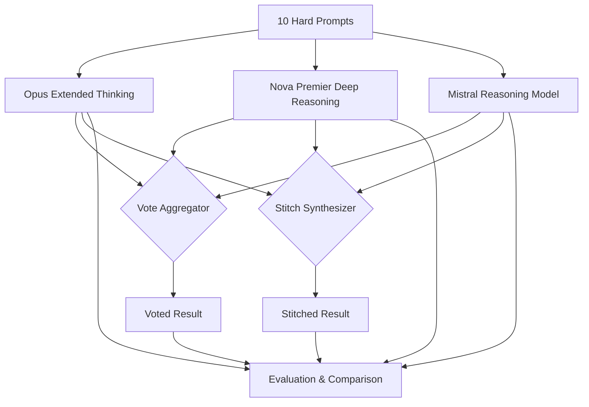

# Requirements: "Do Thinking Models Think Better Together?"

_protoGen project — LLM Ensemble Methods (1 of 3)_

## What We're Building

A practical experiment that ensembles three native chain-of-thought/reasoning models (Claude Opus with extended thinking, Amazon Nova Premier with deep reasoning, and a Mistral-class reasoning model) in a Mixture-of-Agents architecture on AWS Bedrock. We run 10 hard prompts through all three models independently, compare outputs and reasoning divergence, then test vote-based vs stitch-based aggregation. The blog post IS the exploration — methodology, results, surprises, and honest conclusions about whether external ensembling adds value when each model already does internal deliberation.

## Why (Blog Angle)

Every MoA paper assumes "more models = better." But reasoning models already do their own internal ensemble of thought paths. Does stacking an external ensemble on top of internal deliberation compound the benefit, or hit diminishing returns? Nobody has tested this empirically with real reasoning models on a real cloud platform. The tension between internal and external ensembling is unexplored territory — and practitioners deploying these models need to know if the extra cost buys anything.

## Architecture



**Components:**
1. **Prompt harness** — Sends each prompt to all 3 models via Bedrock API, captures full responses + reasoning traces where available
2. **Vote aggregator** — For discrete/factual answers: majority vote. For open-ended: judge model picks best whole response
3. **Stitch synthesizer** — Extracts strongest reasoning elements from each response, synthesizes a combined answer via orchestrator model
4. **Evaluation framework** — Compares individual model outputs vs voted vs stitched results. Tracks convergence/divergence metrics

## Scope

**In:**
- 10 carefully selected hard prompts (mix of: math/logic, code reasoning, nuanced analysis, creative problem-solving, ambiguous ethical scenarios)
- 3 reasoning models on Bedrock (Opus extended thinking, Nova Premier deep reasoning, one Mistral/reasoning-class)
- Vote aggregation (majority for discrete, judge for open-ended)
- Stitch aggregation (extract + synthesize)
- Convergence analysis — how often do models agree? Where they diverge, what diverges (conclusion vs reasoning path)?
- Cost and latency tracking per invocation
- BLOG.md output (Medium-ready)

**Out:**
- More than 10 prompts (keep it focused)
- Non-reasoning models (that's Project 2's territory)
- Fine-tuning or training
- Production deployment code
- Formal statistical analysis (this is exploratory, not a paper)

## Acceptance Criteria

```gherkin
Given the experiment harness is built
When each of the 10 prompts is sent to all 3 reasoning models
Then full responses and available reasoning traces are captured and stored

Given all 3 model responses for a prompt
When vote aggregation is applied
Then a voted result is produced with the selection rationale logged

Given all 3 model responses for a prompt
When stitch aggregation is applied
Then a synthesized result is produced that draws on reasoning from multiple models

Given individual, voted, and stitched results for all 10 prompts
When evaluation is performed
Then a comparison matrix shows: convergence rate, quality delta (ensemble vs best individual), cost per approach, latency per approach

Given the experiment is complete
Then a BLOG.md is produced that walks through methodology, prompt selection rationale, results for each prompt, and honest conclusions about when external ensembling helps/hurts with reasoning models
```

## Key Decisions (from research)

1. **Prompt selection matters enormously.** Easy prompts where all 3 models converge tell us nothing. Pick prompts that are hard enough to create divergence — math with subtle tricks, code with edge cases, analysis requiring domain knowledge.
2. **Vote vs Stitch is the real question.** Voting works for discrete answers. For nuanced responses, stitching is harder and more interesting. Test both, compare honestly. The stitch approach has multiple sub-strategies (pick best whole response, extract+synthesize, use one as draft + others as critique).
3. **The judge model for voting/stitching should be strong** (Opus or Sonnet) — but note the irony: if you need a strong model to judge, you could've just used that model directly. Surface this tension.
4. **Reasoning traces are gold.** Where models disagree, compare not just conclusions but reasoning paths. That's where the insight lives.
5. **Self-consistency baseline.** Consider running Opus 3x with temperature > 0 as a baseline — is same-model self-consistency competitive with cross-model ensembling?

## Resources

- MoA paper: arxiv.org/abs/2406.04692
- Self-Consistency: arxiv.org/abs/2203.11171
- "More Agents Is All You Need": arxiv.org/abs/2402.05120
- Full research context: ~/.openclaw/workspace-techwriter/research/llm-ensemble-methods-context.md
- Bedrock API docs for extended thinking / reasoning modes
