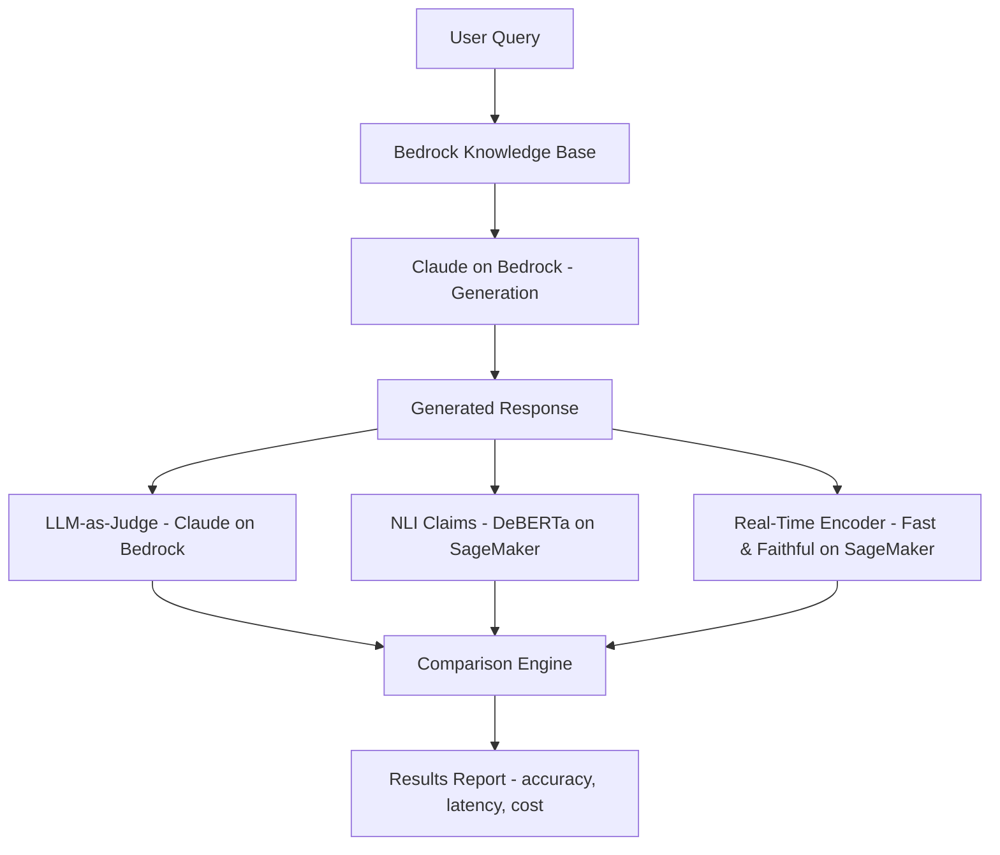

# Requirements: Fast & Faithful RAG Verification

**Source research:** `/root/.openclaw/shared/builder-pipeline/research/w13-rag-verification.md`
**Protogenesis:** Week 13 (second candidate — see note below)
**Date:** 2026-03-29

> **Note:** This is the second W13 research brief. `2026-03-29-agentevals.md` (AgentEvals) was already handed to MasterControl. Pipeline norm is one project per week. MasterControl should prioritize — likely build one this week, queue the other for W14. This RAG verification piece has strong CC-personal angle (follow-up to his TDS article) which may make it higher priority.

---

## What We're Building

A working demo that compares three RAG verification approaches — LLM-as-judge (CC's 2023 pattern, via Claude on Bedrock), NLI claim verification (DeBERTa on SageMaker), and real-time encoder verification (Fast & Faithful model on SageMaker) — against a Bedrock Knowledge Base RAG pipeline. Produces a side-by-side accuracy/latency/cost comparison and a Medium-ready blog post framed as CC's follow-up to his original "How to Measure RAG" TDS article.

## Why (Blog Angle)

"I proposed LLM-as-judge for RAG before it had a name. Here's what comes next." CC's Oct 2023 TDS article was one of the earliest systematic proposals for using an LLM to evaluate RAG output. Now every RAG framework uses this pattern. This post shows its limits (cost, latency, inconsistency) and presents the next evolution: dedicated encoder-based verification models that run in milliseconds, not seconds. The personal angle (author returning to update his own pioneering work) is strong for engagement.

## Architecture



### Key Components

1. **RAG Pipeline** (`rag_pipeline.py`): Bedrock Knowledge Base retrieval + Claude generation. Produces context + query + response triples for evaluation.

2. **LLM-as-Judge Evaluator** (`evaluators/llm_judge.py`): CC's original pattern — prompt Claude to score faithfulness. Logs latency and token cost per eval.

3. **NLI Claim Evaluator** (`evaluators/nli_claims.py`): Decompose response into claims, check each against context via DeBERTa cross-encoder on SageMaker. Faithfulness = minimum claim score.

4. **Real-Time Encoder Evaluator** (`evaluators/realtime_encoder.py`): Fast & Faithful model (extended ModernBERT, 32K context) on SageMaker. Token-level hallucination detection. Returns hallucinated spans.

5. **Comparison Runner** (`compare.py`): Runs all three evaluators on same inputs, produces structured results with accuracy/latency/cost breakdown.

6. **Test Dataset** (`data/`): Curated set of RAG query-response pairs — mix of faithful, partially hallucinated, and fully hallucinated responses. ~20-30 examples.

7. **Report Generator** (`report.py`): Produces markdown comparison tables and summary stats for the blog post.

## Scope

### In Scope
- Bedrock Knowledge Base RAG pipeline (simple document set — can use CC's existing content or synthetic docs)
- LLM-as-judge evaluator using Claude on Bedrock (CC's original pattern)
- NLI claim verification using DeBERTa-v3-large on SageMaker endpoint
- Fast & Faithful encoder verification on SageMaker endpoint (if model available on HuggingFace; fallback to conceptual demo with LettuceDetect if not)
- Side-by-side comparison: accuracy, latency (ms), cost per evaluation
- Test dataset with labeled faithful/hallucinated responses
- BLOG.md — Medium-ready, copy-paste, framed as CC's follow-up article
- README with setup, deployment, and reproduction instructions

### Out of Scope
- Production-hardened SageMaker deployment (demo endpoints only, not auto-scaling)
- DynaRAG or Controllable Evidence Selection implementation (referenced in blog as complementary approaches, not built)
- Custom model fine-tuning (use pre-trained models from HuggingFace)
- CI/CD integration for continuous RAG evaluation
- Multi-document / multi-turn RAG scenarios (single-turn only)

## Acceptance Criteria

```gherkin
Feature: RAG Pipeline
  Scenario: Generate response from Knowledge Base
    Given a Bedrock Knowledge Base with indexed documents
    When a query is submitted
    Then the pipeline returns context chunks + generated response
    And both are stored for evaluation

Feature: LLM-as-Judge Evaluation
  Scenario: Faithful response
    Given a response grounded in retrieved context
    When LLM-as-judge evaluates faithfulness
    Then score >= 0.8
    And latency is logged (expected: 2-5 seconds)

  Scenario: Hallucinated response
    Given a response containing fabricated claims
    When LLM-as-judge evaluates faithfulness
    Then score <= 0.3

Feature: NLI Claim Verification
  Scenario: Faithful response
    Given a response with all claims entailed by context
    When NLI evaluator checks each claim
    Then all claims score entailment > 0.7
    And total latency < 500ms

  Scenario: Partially hallucinated response
    Given a response mixing faithful and hallucinated claims
    When NLI evaluator checks each claim
    Then hallucinated claims score entailment < 0.3
    And faithful claims score > 0.7

Feature: Real-Time Encoder Verification
  Scenario: Token-level detection
    Given a response with a hallucinated span
    When the encoder model processes context + query + response
    Then the hallucinated tokens are flagged
    And latency < 50ms for responses under 8K tokens

Feature: Comparison
  Scenario: Head-to-head on same inputs
    Given the same 20+ query-response pairs
    When all three evaluators run
    Then results include: per-evaluator scores, latency_ms, estimated cost
    And a markdown comparison table is generated
    And accuracy correlation between methods is computed

Feature: Blog Output
  Scenario: BLOG.md is complete
    Given the comparison results
    Then BLOG.md contains: hook referencing CC's 2023 article, problem statement, evolution arc, working code snippets, comparison table, architecture diagram description, conclusion
    And word count is 2500-3500
    And tone matches CC's TDS writing style
```

## Key Decisions (from research)

1. **Three-approach comparison, not single implementation**: The blog narrative requires showing the progression from CC's original LLM-as-judge → NLI → real-time encoder. Building all three and comparing them IS the project.

2. **Bedrock + SageMaker stack**: RAG pipeline on Bedrock (Knowledge Base + Claude), verification models on SageMaker. This is the natural AWS split — foundation models on Bedrock, custom/specialized models on SageMaker.

3. **DeBERTa-v3-large for NLI**: Best general-purpose NLI cross-encoder. Deploy via HuggingFace DLC on SageMaker ml.g5.xlarge.

4. **Fast & Faithful if available, LettuceDetect as fallback**: The Fast & Faithful model (llm-semantic-router on HuggingFace) is the ideal 32K-context encoder. If it's not readily deployable, fall back to LettuceDetect (8K context) and note the limitation — the blog argument still holds.

5. **Deterministic test dataset**: Pre-labeled faithful/hallucinated responses. Don't rely on LLM-generated test data (per arXiv 2603.20101 contamination warnings).

6. **Blog framed as CC's personal follow-up**: Not a generic "RAG evaluation guide." It's "I wrote the original, here's the update." This personal angle is the differentiator.

## Resources

- [CC's original TDS article](https://towardsdatascience.com/how-to-measure-the-success-of-your-rag-based-llm-system-874a232b27eb) — The foundation this builds on
- [Fast & Faithful (arXiv 2603.23508)](https://arxiv.org/abs/2603.23508) — Centerpiece paper
- [Fast & Faithful models (HuggingFace)](https://huggingface.co/llm-semantic-router) — Pre-trained models
- [cross-encoder/nli-deberta-v3-large](https://huggingface.co/cross-encoder/nli-deberta-v3-large) — NLI model
- [DynaRAG (arXiv 2603.18012)](https://arxiv.org/abs/2603.18012) — Complementary reference
- [Controllable Evidence Selection (arXiv 2603.18011)](https://arxiv.org/abs/2603.18011) — Complementary reference
- [RAGAS Faithfulness docs](https://docs.ragas.io/en/stable/concepts/metrics/available_metrics/faithfulness) — Existing approach reference
- [DeepEval RAG Evaluation](https://deepeval.com/guides/guides-rag-evaluation) — Existing approach reference
- [SageMaker HuggingFace DLC](https://docs.aws.amazon.com/sagemaker/latest/dg/hugging-face.html) — Deployment reference

## Build Location

`/root/projects/protoGen/rag-verification/`
